# AgriFarm MVP - سامانه مدیریت کشاورزی هوشمند

[](LICENSE)
[](https://www.python.org/)
[](https://nextjs.org/)
[](https://fastapi.tiangolo.com/)

| 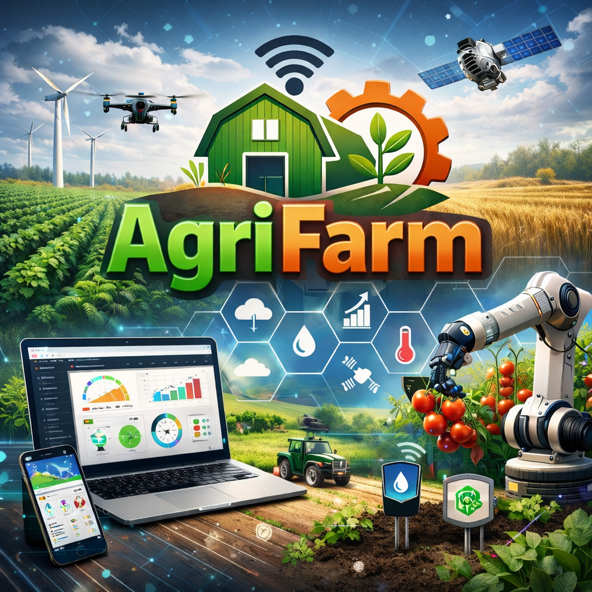 | **:** AgriFarm سامانه تصمیم یار هوشمند مدیریت منابع کشاورزی برای بهینه سازی مصرف آب و انرژی با هدف حمایت از احیای اکوسیستم دریاچه ارومیه |
|--------------------------------------------------------|--------------------------------------------------------|


## 📋 معرفی

آگریفارم یک سامانه هوشمند برای کمک به کشاورزان و مدیران منابع کشاورزی است که:
- مصرف آب و انرژی را بهینه می‌ کند
- محصول بهینه را پیشنهاد می‌ دهد
- سودآوری اقتصادی را مدیریت می‌ کند

این ایده مبتنی بر ترکیبی از تخصص در مدیریت فناوری اطلاعات، علوم داده و تحلیل سیستم‌ های هوشمند است.

## 🎯 هدف اصلی پروژه

هدف اصلی سامانه تصمیم‌ یار هوشمند مدیریت منابع کشاورزی (AgriFarm)، **بهینه‌ سازی بهره‌ وری منابع آب و انرژی در کشاورزی و حمایت از احیای اکوسیستم دریاچه ارومیه** است. این سامانه با استفاده از الگوریتم‌ های هوش مصنوعی، تحلیل داده‌ های زمین، خاک، منابع آب و انرژی، اقلیم و الگوی کشت، امکان تصمیم‌ گیری علمی، داده‌ محور و شبیه‌ سازی سناریو های مختلف کشاورزی را برای کشاورزان و مدیران منابع فراهم می‌ آورد.

### مکانیسم تأثیر بر احیای دریاچه ارومیه:

- **مدیریت مصرف آب**: سامانه با پیش‌بینی دقیق نیاز آبی محصولات و شبیه‌سازی سناریوهای کم‌آب‌بر، از برداشت غیرمجاز و مصرف بی‌رویه آب جلوگیری می‌ کند.

- **بهینه‌ سازی انرژی و منابع**: الگوریتم‌ها میزان مصرف برق و انرژی مربوط به آبیاری را کاهش داده و بهره‌وری عملیاتی را افزایش می‌ دهند.

- **انتخاب محصول کم‌ آب‌ بر و سودآور**: توصیه‌های داده‌محور برای انتخاب محصول با حداقل مصرف آب و حداکثر بازده اقتصادی ارائه می‌ شود.

- **پیش‌ بینی و سناریوسازی اقتصادی و اکولوژیک**: امکان شبیه‌سازی اثر تغییرات اقلیمی، میزان بارش و دسترسی به منابع بر تولید و مصرف آب فراهم است.

### ویژگی‌ های علمی و نوآورانه:

- استفاده از مدل‌های پیش‌بینی مبتنی بر داده‌های چندمنظوره (Multivariate Data Modeling) و یادگیری ماشین برای مدیریت منابع آب
- بومی‌سازی الگوریتم‌ها برای شرایط اقلیمی و کشاورزی منطقه دریاچه ارومیه
- ارائه تصمیم‌یار هوشمند برای سیاست‌گذاری منابع و برنامه‌ریزی بهره‌برداری پایدار
- قابلیت اتصال به پایگاه‌های داده دولتی و سنجش از راه دور برای داده‌های آب و انرژی

### نتیجه مورد انتظار:

استفاده گسترده از سامانه AgriFarm موجب کاهش برداشت بی‌رویه آب، مدیریت پایدار منابع، افزایش بهره‌وری اقتصادی کشاورزان و تسریع روند احیای اکوسیستم دریاچه ارومیه خواهد شد.

---

## 🎯 Project Objective – AgriFarm (English, Technical Version)

🌱 AgriFarm — Smart Farming Optimization  
🚀 AI-based crop recommendation & water/energy prediction  
📍 Target: Sustainable agriculture for Lake Urmia ecosystem

The primary objective of the AgriFarm Smart Decision Support System for Agricultural Resource Management is to **optimize water and energy efficiency in agriculture while supporting the ecological restoration of Lake Urmia**. The platform leverages artificial intelligence algorithms, data analytics, and predictive modeling on soil, land, water, energy, climate, and crop patterns to enable scientific, data-driven decision-making and scenario simulations for farmers and resource managers.

### Mechanisms for Impact on Lake Urmia Restoration:

- **Water Use Management**: The system predicts precise crop water requirements and simulates low-water-use scenarios, preventing over-extraction and unsustainable irrigation practices.

- **Energy and Resource Optimization**: AI-driven recommendations minimize electricity and energy consumption in irrigation, enhancing operational efficiency.

- **Crop Selection Optimization**: Data-driven guidance supports choosing crops with minimal water demand and maximum economic return.

- **Economic and Ecological Scenario Simulation**: Users can simulate the impacts of climate variability, rainfall, and water availability on crop yield and resource consumption.

### Scientific and Innovative Features:

- Utilizes multivariate predictive models and machine learning for intelligent water and resource management
- Locally adapted algorithms for the climatic and agricultural conditions of the Lake Urmia region
- Provides a decision support tool for sustainable resource planning and agricultural policy-making
- Integrates with remote sensing and governmental databases for real-time water and energy monitoring

## ✨ Key Features

- AI-based water & energy consumption prediction  
- Optimal crop recommendation  
- Scenario simulation (economic + ecological)  
- Smart dashboards  
- Export to PDF/CSV  

### Expected Outcomes:

Widespread adoption of AgriFarm is projected to reduce water overuse, promote sustainable resource management, enhance farmers' economic efficiency, and accelerate the ecological restoration of Lake Urmia.

---

## 🏗️ معماری سیستم

```
AgriFarm/
├── backend/          # FastAPI Backend
│   ├── app/
│   │   ├── api/      # API endpoints
│   │   ├── models/   # Database models
│   │   ├── services/ # Business logic & AI algorithms
│   │   └── main.py   # FastAPI app
│   └── requirements.txt
│
├── frontend/         # Next.js Frontend
│   ├── app/          # Next.js app directory
│   ├── components/   # React components
│   └── package.json
│
└── database/         # Database scripts
    └── init.sql      # Schema & sample data
```

## 🚀 راه‌اندازی سریع

### پیش‌نیازها
- Python 3.9+
- Node.js 18+
- PostgreSQL 14+

### 1. راه‌اندازی Backend

```bash
cd backend
python -m venv venv
source venv/bin/activate  # Windows: venv\Scripts\activate
pip install -r requirements.txt
uvicorn app.main:app --reload
```

Backend در `http://localhost:8000` اجرا می‌شود.

### 2. راه‌اندازی Database

```bash
# ایجاد دیتابیس
createdb agrifarm

# اجرای اسکریپت اولیه
psql agrifarm < database/init.sql
```

### 3. راه‌اندازی Frontend

```bash
cd frontend
npm install
npm run dev
```

Frontend در `http://localhost:3000` اجرا می‌شود.

## 📊 ویژگی‌های MVP

- ✅ فرم ورود اطلاعات مزرعه و محصول
- ✅ محاسبه مصرف پیش‌بینی شده آب و انرژی
- ✅ پیشنهاد محصول بهینه بر اساس شرایط
- ✅ داشبورد با نمودارهای ساده
- ✅ خروجی PDF/CSV

## 📸 اسکرین‌شات‌ها

> مسیر فایل‌ها: `frontend/public/screenshots/`  

| نما | توضیحات |
| --- | --- |
| 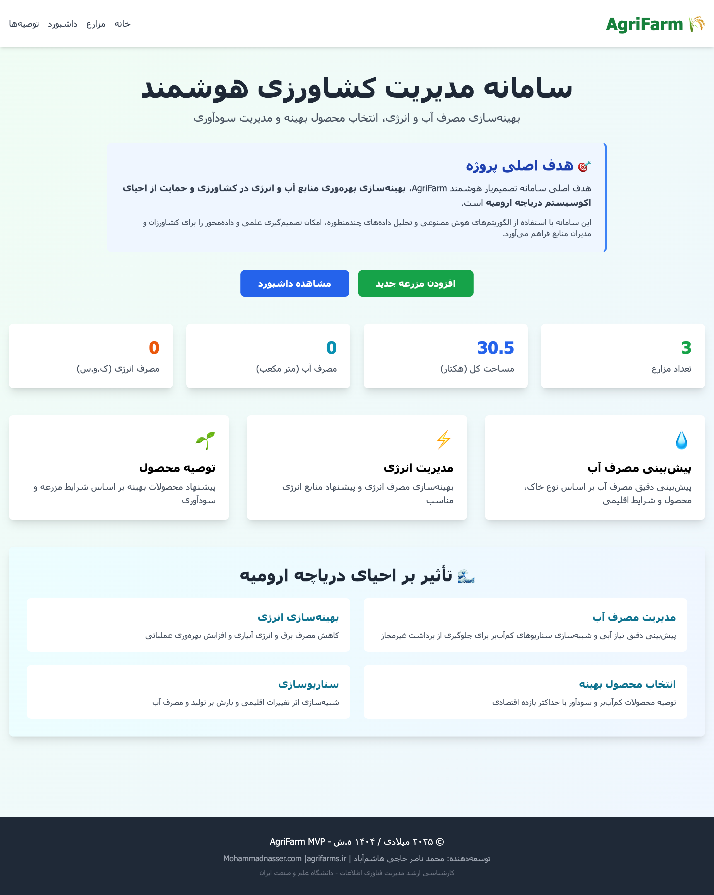 | **خانه:** معرفی هدف پروژه، CTA برای افزودن مزرعه و مشاهده داشبورد، آمار خلاصه و بلوک‌های مزیت‌ها |
| 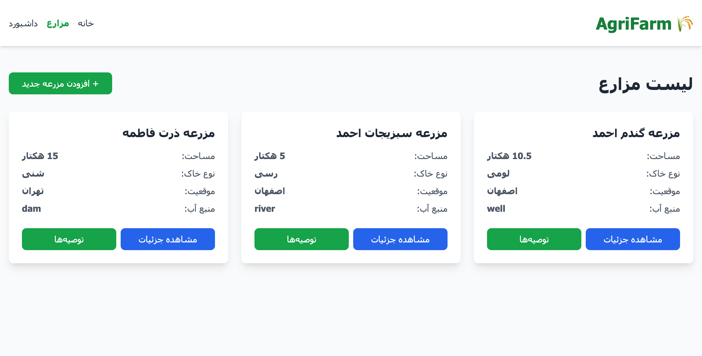 | **لیست مزارع:** کارت‌های خلاصه مزرعه با مساحت، نوع خاک، موقعیت و دسترسی به جزئیات/توصیه‌ها |
|  | **لیست مزارع (خالی):** دعوت به ثبت اولین مزرعه با CTA سبز |
| 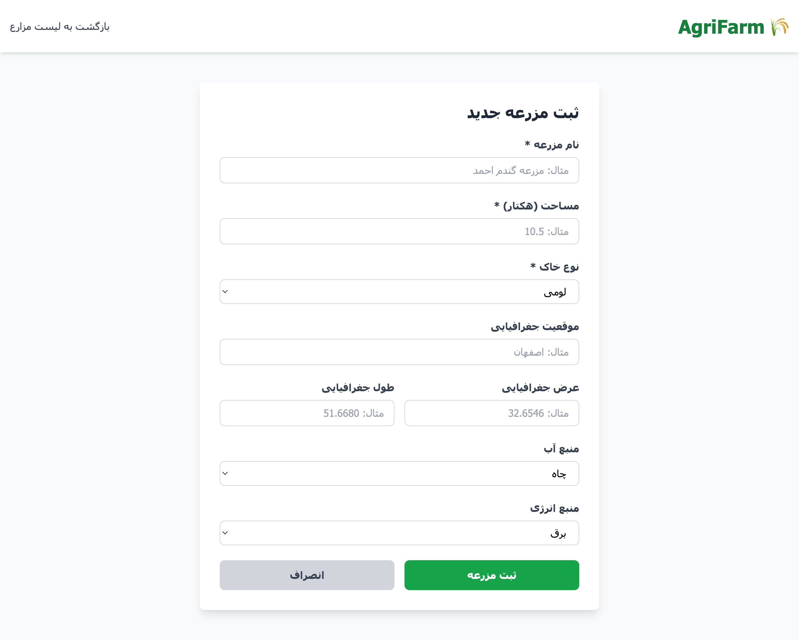 | **فرم ایجاد مزرعه:** ورودی مساحت، نوع خاک، موقعیت، مختصات و منابع آب/انرژی |
| 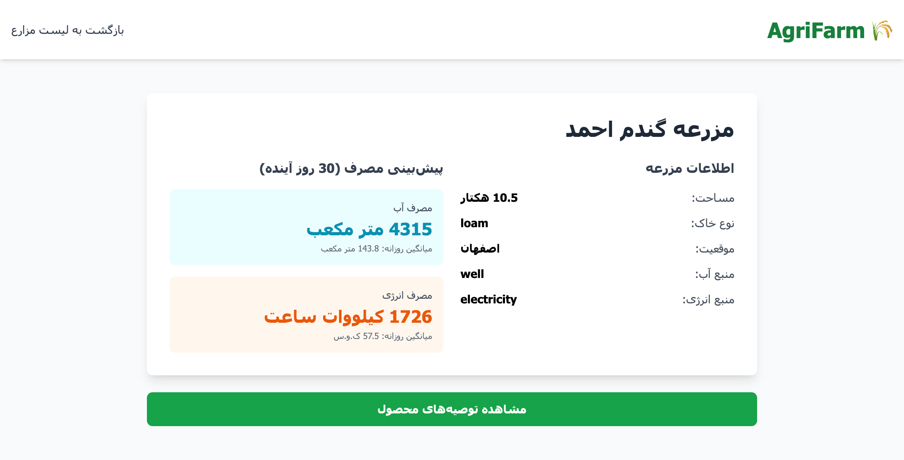 | **جزئیات مزرعه گندم احمد:** پیش‌بینی مصرف ۳۰ روزه آب/انرژی و اطلاعات پایه مزرعه |
| 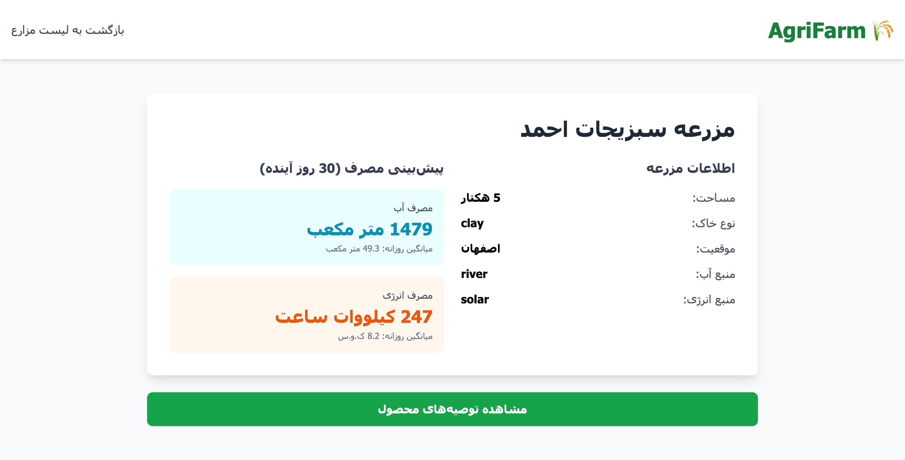 | **جزئیات مزرعه سبزیجات احمد:** مقادیر مصرف و مشخصات مزرعه (خاک رس، منبع آب رودخانه، انرژی خورشیدی) |
| 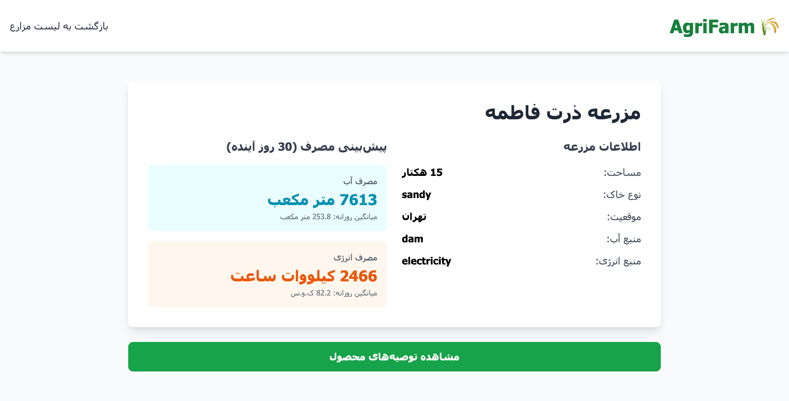 | **جزئیات مزرعه ذرت فاطمه:** پیش‌بینی مصرف برای مزرعه شنی با منبع آب سد |
| 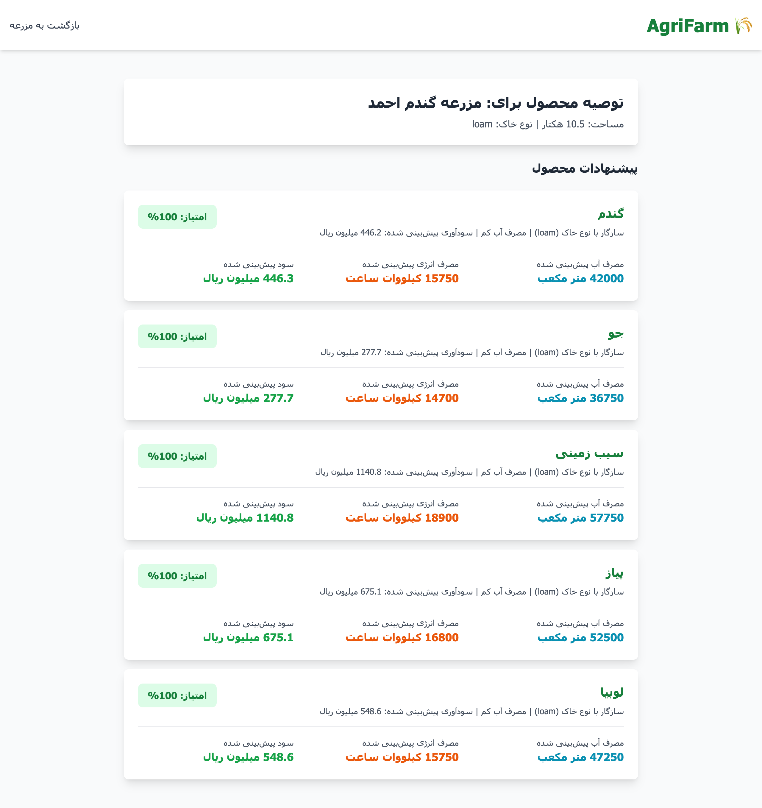 | **توصیه محصول برای مزرعه گندم احمد:** فهرست محصولات پیشنهادی با امتیاز اطمینان، مصرف آب/انرژی و سود پیش‌بینی‌شده |
| 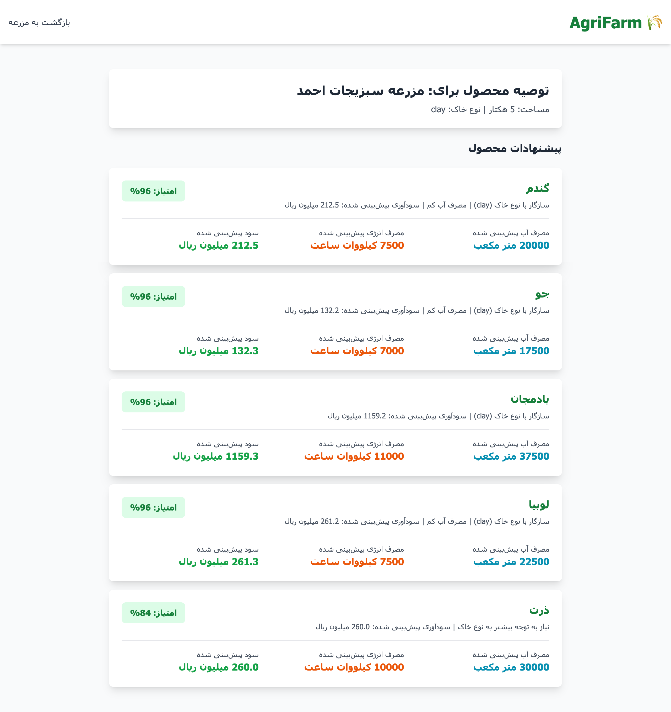 | **توصیه محصول برای مزرعه سبزیجات احمد:** گزینه‌های کشت با سود و هزینه منابع متناسب با خاک رس |
| 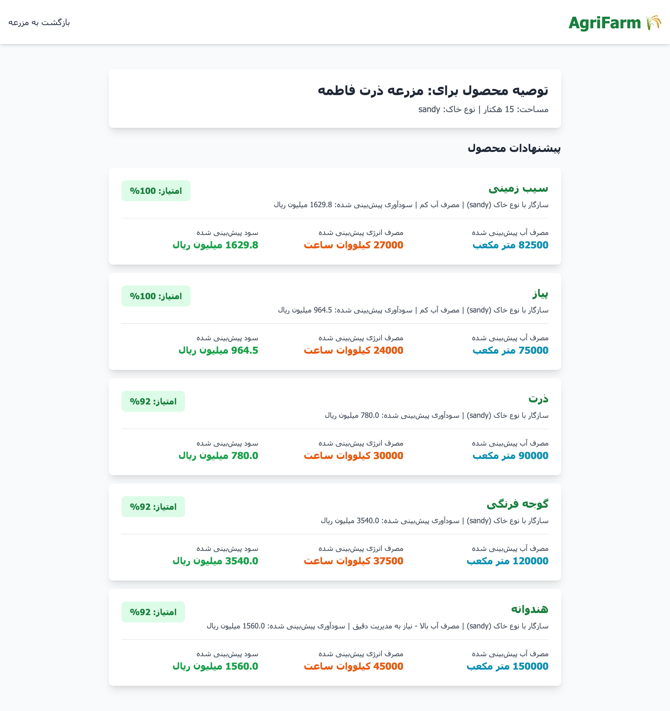 | **توصیه محصول برای مزرعه ذرت فاطمه:** سناریوهای کشت روی خاک شنی با برآورد سود و منابع |
| 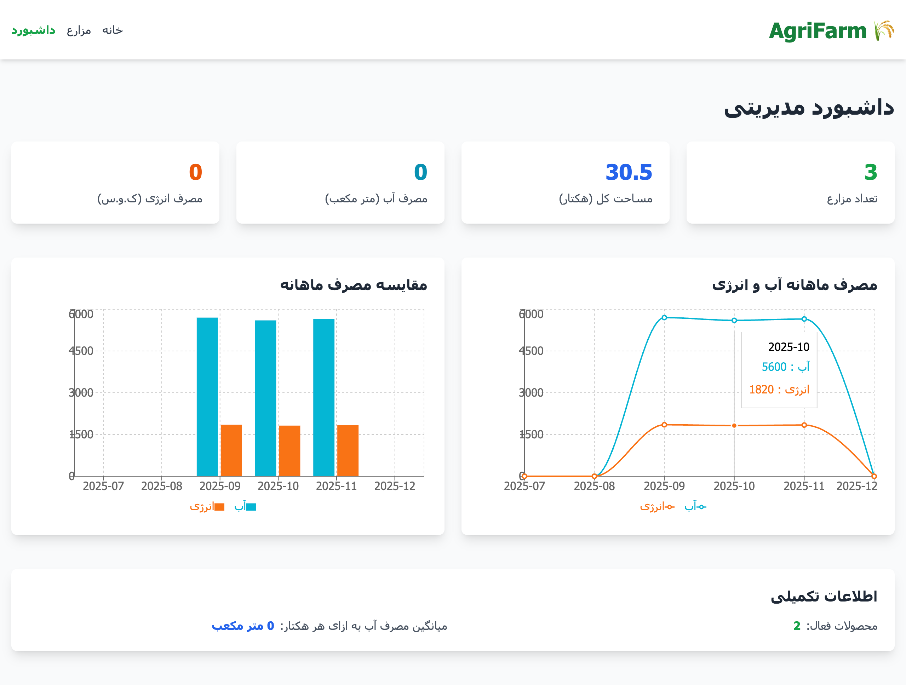 | **داشبورد مدیریتی:** آمار تعداد مزارع، مساحت کل، مصرف آب/انرژی و نمودارهای ماهانه |
| 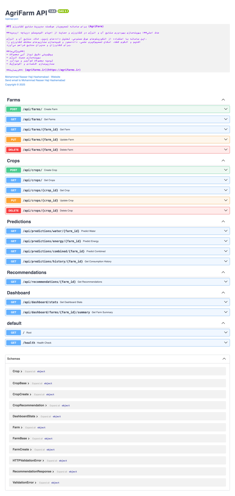 | **Swagger UI:** لیست اندپوینت‌های API (مزارع، محصولات، پیش‌بینی‌ها، توصیه‌ها و داشبورد) برای تست سریع |

## 🔗 API Documentation

پس از راه‌اندازی Backend، مستندات API در `http://localhost:8000/docs` در دسترس است.

## 📝 داده‌های نمونه

سیستم با داده‌های نمونه از پیش بارگذاری شده است که می‌توانید برای تست استفاده کنید.

## 📄 مجوز و حقوق

© ۲۰۲۵ میلادی / ۱۴۰۴ هجری شمسی - محمد ناصر حاجی هاشم‌آباد  
تمام حقوق محفوظ است.

این پروژه به‌عنوان یک MVP (Minimum Viable Product) برای تست میدانی و دریافت بازخورد کاربران طراحی شده است.

## 🤝 مشارکت

برای مشارکت در توسعه این پروژه یا ارائه بازخورد، لطفاً با ایمیل info@mohammadnasser.com تماس بگیرید.

راهنمای کامل مشارکت در فایل [CONTRIBUTING.md](CONTRIBUTING.md) موجود است.

**مخزن GitHub:** [naserhha/agrifarm](https://github.com/naserhha/agrifarm)

## 📚 مستندات بیشتر

- [هدف اصلی پروژه](OBJECTIVES.md) - هدف اصلی و مکانیسم تأثیر بر احیای دریاچه ارومیه
- [اطلاعات پروژه](PROJECT_INFO.md) - جزئیات کامل پروژه
- [اطلاعات توسعه‌دهنده](AUTHORS.md) - اطلاعات توسعه‌دهنده و تخصص‌ها
- [راهنمای نصب Frontend](frontend/INSTALL.md) - حل مشکلات نصب
- [راهنمای راه‌اندازی Frontend](frontend/SETUP.md) - راه‌اندازی کامل

## ⚙️ تنظیمات محیط

قبل از اجرا، فایل‌های `.env.example` را کپی کرده و به `.env` تغییر نام دهید:

```bash
# Backend
cp backend/.env.example backend/.env
# سپس مقادیر را ویرایش کنید

# Frontend
cp frontend/.env.example frontend/.env.local
# سپس مقادیر را ویرایش کنید
```
## 👨‍💻 توسعه‌دهنده

**محمد ناصر حاجی هاشم‌آباد**  
📧 Email: info@mohammadnasser.com  
🌐 Website: [Mohammadnasser.com](https://mohammadnasser.com)

**تحصیلات:** کارشناسی ارشد مدیریت فناوری اطلاعات – دانشگاه علم و صنعت ایران

**تخصص‌ها:**
- طراحی معماری سامانه‌های اطلاعاتی
- تحلیل داده‌های حجیم (Big Data)
- مدل‌سازی تصمیم‌یار
- پیاده‌سازی الگوریتم‌های پیش‌بینی
- تحلیل سری‌های زمانی
- طراحی داشبوردهای تحلیلی
- توسعه نمونه‌های اولیه تحت وب

